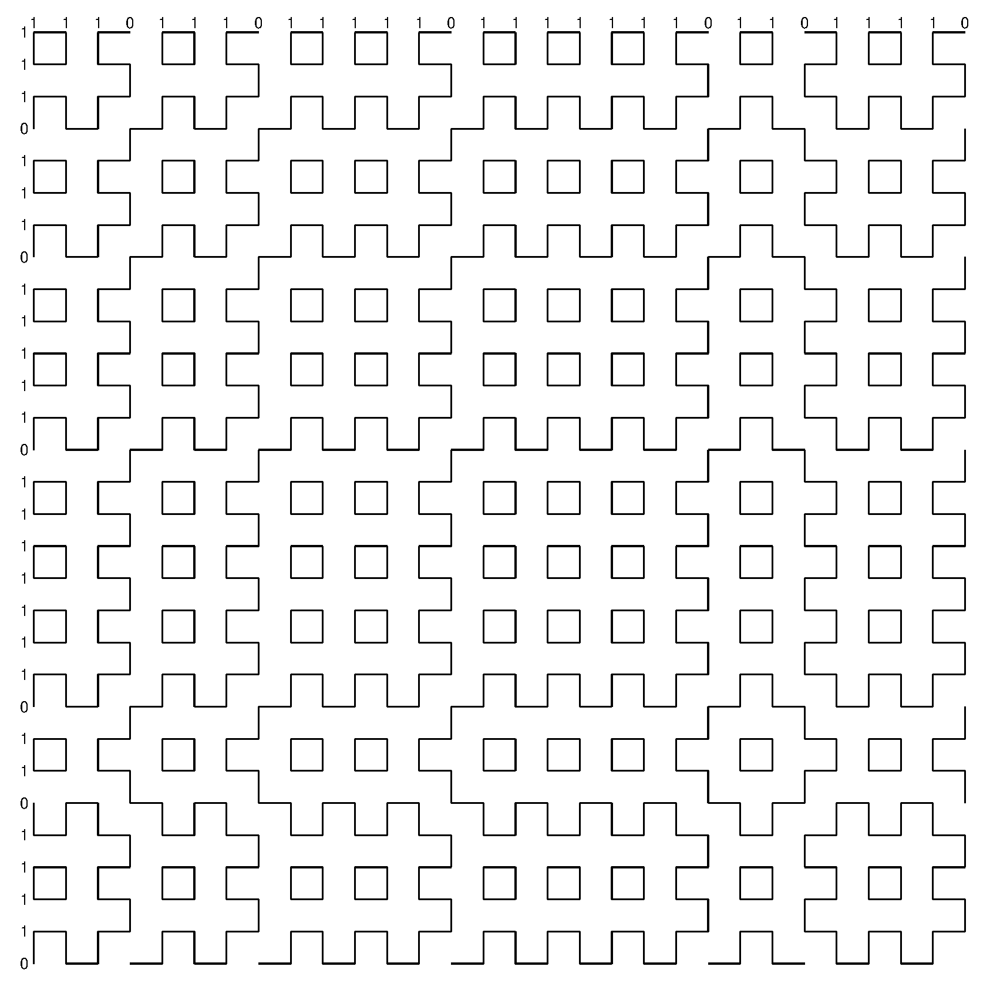

# Fractal Pattern Generator from Integer Sequences
by: Rodrigo Wuerdig and Matheus Bohrer

This tool creates an binary-oriented representation of Integer sequences using Python and tkinter. It converts each integer into its binary representation, filling an bi-dimensional pattern where:

0 follows s-s-s-s-s-...

1 follows -s-s-s-s-s...

(s stands for space)

**Fig. I - Representation of a 10x10 integer sequence**

The integer sequence presented on Fig. I is: 1, 1, 2, 3, 5, 7, 11, 15, 22, 30.

The tool outputs a postscript file containing the output pattern.
